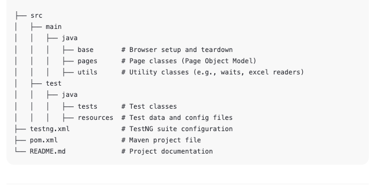

# Magento Selenium Automation Framework
📄 Project Overview
This project is a Selenium Automation Framework for testing the Magento Demo E-commerce Application.
It is built using Java, Selenium WebDriver, TestNG, Maven, and Page Object Model (POM) design pattern.

The goal is to automate core user journeys like login, search, product selection, and checkout in the Magento application.

🚀 Tech Stack
Java 17

Selenium 4

TestNG

Maven

WebDriverManager

Page Object Model (POM)

##Project Structure

## 🛠️ Setup Instructions
Clone the repository:
bash
Copy
Edit
git clone https://github.com/abhishekSharma000888/MagentoSeleniumFramework.git
Import the project as a Maven Project in IntelliJ IDEA or Eclipse.

Run the tests: